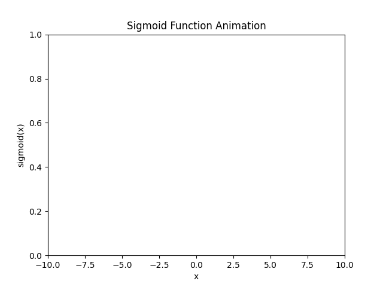

# 活性化関数入門（1）

## 1. 活性化関数とは？

これまで学んできたパーセプトロンは、入力に重みを掛けた合計値（スコア）をしきい値と比較し、
"OK" または "NG" を出力するシンプルな仕組みでした。

しかし、この方法では単純なルールでしか判断できず、より柔軟に学習するには工夫が必要です。

そこで登場するのが **活性化関数** です。

活性化関数を使うことで、
- **出力を 0~1 の範囲に収める**
- **確率的な解釈ができるようになる**
- **より複雑なデータに対応できる**

といったメリットがあります。

---

## 2. シグモイド関数とは？

最も基本的な活性化関数の一つに **シグモイド関数** があります。

シグモイド関数は、入力を受け取って **なめらかに 0 から 1 の間の値に変換する** ものです。

例えば、入力が **大きな正の数** なら 1 に近づき、
逆に **小さな負の数** なら 0 に近づく特性があります。
また、入力が **0 のときはちょうど 0.5** になります。

📌 **イメージ**
- 小さな値 → 出力は 0 に近い
- 0 付近 → 出力は 0.5
- 大きな値 → 出力は 1 に近い

これにより、数値を **確率のように扱える** ため、分類問題に適しています。



---

## 3. データの正規化とは？

シグモイド関数を適用する前に、入力データを適切な範囲にスケールすることが重要です。
これは **正規化** と呼ばれます。

### **なぜ正規化が必要なのか？**

- **入力データの範囲がバラバラだと、学習がうまくいかない**
  - 例えば、1～100のデータと0.01～1のデータを一緒に扱うと、
    影響が大きい値に偏ってしまいます。
- **活性化関数の効果を最大限に引き出すため**
  - シグモイド関数は0付近でなめらかに変化します。
    入力値が極端に大きかったり小さかったりすると、出力がほぼ0か1に張り付いてしまい、
    学習が進みにくくなります。

### **正規化の方法**

入力データを0～1の範囲に収めるには、以下のようにします。
```python
# 入力データを0～1にスケーリングする関数
def normalize(inputs):
    max_val = max(inputs)
    min_val = min(inputs)
    return [(x - min_val) / (max_val - min_val) for x in inputs]
```

これで、データのスケールを統一し、活性化関数の効果を最大限に活かすことができます。

---

## 4. シグモイド関数を使ったパーセプトロン

では、今までの **パーセプトロン** に **シグモイド関数** を適用してみましょう。

### **コード例：シグモイド関数の適用**
```python
import math

# シグモイド関数の定義
def sigmoid(x):
    print(f"sigmoid関数に渡された値: {x}")
    return 1 / (1 + math.exp(-x))

# 入力データを0～1にスケーリングする関数
def normalize(inputs):
    max_val = max(inputs)
    min_val = min(inputs)
    normalized = [(x - min_val) / (max_val - min_val) for x in inputs]
    print(f"正規化後の入力データ: {normalized}")
    return normalized

# 予測関数（活性化関数付き）
def perceptron_with_sigmoid(inputs, weights):
    print(f"入力データ: {inputs}")
    print(f"重み: {weights}")
    
    # 線形結合の計算
    score = sum(inputs[i] * weights[i] for i in range(len(inputs)))
    print(f"線形結合の結果: {score}")
    
    # シグモイド関数を適用
    probability = sigmoid(score)
    print(f"シグモイド関数の出力確率: {probability}")
    
    # 閾値0.5で判定
    result = "OK" if probability >= 0.5 else "NG"
    print(f"最終判定: {result}")
    
    return probability, result

# テストデータ
test_case = [80, 50, 90]  # 入力データ
weights = [0.9, 0.6, 1.0]  # 仮の重み

# 正規化処理
test_case_normalized = normalize(test_case)

# 予測実行
prob, result = perceptron_with_sigmoid(test_case_normalized, weights)
print(f"確率: {prob:.4f}, 判定: {result}")
```

### **出力**
```
正規化後の入力データ: [0.75, 0.0, 1.0]
入力データ: [0.75, 0.0, 1.0]
重み: [0.9, 0.6, 1.0]
線形結合の結果: 1.675
sigmoid関数に渡された値: 1.675
シグモイド関数の出力確率: 0.84224131298103
最終判定: OK
確率: 0.8422, 判定: OK
```

📌 **視覚的なイメージ**
🔵 **入力が大きい** → 出力は 1 に近づく（確率が高い）
🔴 **入力が小さい** → 出力は 0 に近づく（確率が低い）

---

## 5. 活性化関数を使うメリット

シグモイド関数を導入すると、以下のようなメリットがあります。

1. **0~1の範囲に収まるため、確率的な解釈ができる**
2. **学習時に誤差をなめらかに調整できる**
3. **単純な判定だけでなく、より柔軟な予測が可能になる**

しかし、シグモイド関数には **勾配消失問題** という弱点もあります。
これを克服するために、他の活性化関数（ReLU, tanh など）が使われることもあります。

次回は、 **他の活性化関数** について詳しく学んでいきましょう！

